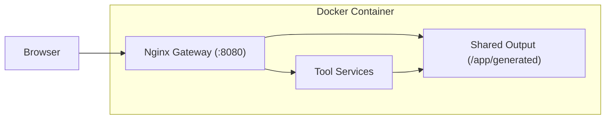

# X Workbench

> A monorepo of execution-focused tools for accelerating human-AI workflows

[](https://github.com/cofy-x/x-workbench/actions/workflows/ci.yml)
[](LICENSE)

**cofy-x** = **Co**ordination + **Fly** + **X**  
Coordination through human-AI collaboration. Fly through accelerated execution. X for infinite AI-powered possibilities.

## What is x-workbench?

`x-workbench` is a collection of small, independent tools designed to improve content creation workflows. Each tool provides both a web UI and CLI interface, focusing on practical tasks like video processing, logo generation, subtitle creation, and format conversion.

**Key features:**
- 🚀 **One-command deployment** — Docker gateway runs all tools with zero configuration
- 🎯 **Web + CLI** — Use the browser UI or automate via command line
- 🔧 **Independent tools** — Each tool works standalone, no cross-dependencies
- 🎬 **Media-focused** — Built for video creators, designers, and content producers

## Quick Start

### Option 1: Docker (Recommended)

Run all tools in one container with automatic routing:

```bash
docker pull ghcr.io/cofy-x/x-workbench:latest
docker run -d --name x-workbench \
  -p 8080:8080 \
  -v "$(pwd)/generated:/app/generated" \
  ghcr.io/cofy-x/x-workbench:latest
```

Open **http://localhost:8080** to access the gateway.

### Option 2: Run Individual Tools

```bash
# Install dependencies
pip install uv
uv sync

# Start a specific tool
make serve TOOL=video_kit
```

## Available Tools

| Tool | Description | Use Case |
|------|-------------|----------|
| **[video_kit](tools/video_kit/README.md)** | FFmpeg video processing | Speed up demos, cut segments, resize, convert to GIF |
| **[multi_format_exporter](tools/multi_format_exporter/README.md)** | Batch video format export | Export one video to TikTok, YouTube, Instagram formats |
| **[subtitle_studio](tools/subtitle_studio/README.md)** | Speech-to-subtitle transcription | Auto-generate and burn-in subtitles using Whisper |
| **[storyboard_builder](tools/storyboard_builder/README.md)** | Video frame extraction | Create contact sheets and timeline summaries |
| **[logo_generator](tools/logo_generator/README.md)** | Brand logo generation | Generate icon and logo variants for light/dark modes |

## Usage Examples

### Video Kit — Speed up a demo video

```bash
# Web UI
make serve TOOL=video_kit

# CLI
uv run python tools/video_kit/app.py --process -i demo.mp4 --speed 2.67
```

### Multi Format Exporter — Export to social media formats

```bash
# Export to TikTok (1080x1920), YouTube (1920x1080), and Square (1080x1080)
uv run python tools/multi_format_exporter/app.py --process -i video.mp4 \
  --preset tiktok --preset youtube --preset square
```

### Subtitle Studio — Add subtitles

```bash
# Auto-transcribe and burn-in subtitles
uv run python tools/subtitle_studio/app.py --process -i video.mp4 \
  --lang auto --model small --burn-in --style clean
```

See individual tool READMEs for complete documentation.

## Docker Gateway

The Docker gateway provides a unified interface to all tools through Nginx reverse proxy.

### Architecture



**Key components:**
- **Nginx** — Single entry point, handles routing and static file serving
- **Tool Services** — Each tool runs independently on internal ports
- **Shared Storage** — All tools write to `/app/generated`, mounted from host

Tool services are managed internally by Supervisor (process manager).

### Build and Run

Using Makefile:

```bash
make docker-build
make docker-run
```

Or Docker directly:

```bash
docker build -t x-workbench:latest .
docker run -d --name x-workbench \
  -p 8080:8080 \
  -v "$(pwd)/generated:/app/generated" \
  -v x-workbench-whisper-cache:/data/hf \
  x-workbench:latest
```

### Routes

- **`/`** — Gateway landing page with tool links
- **`/healthz`** — Health check endpoint
- **`/tools/<tool_name>/`** — Individual tool web UIs
- **`/generated/`** — Static file serving for outputs

### Volume Mounts

| Host Path | Container Path | Purpose |
|-----------|----------------|---------|
| `./generated` | `/app/generated` | Persistent storage for all generated files |
| `x-workbench-whisper-cache` | `/data/hf` | Hugging Face model cache for subtitle_studio |

### Management

```bash
# View logs
make docker-logs

# Stop container
make docker-stop

# Restart
docker restart x-workbench
```

## Development

### Prerequisites

- Python >= 3.13
- [uv](https://docs.astral.sh/uv/) for dependency management
- [ffmpeg](https://ffmpeg.org/) for video tools

```bash
# macOS
brew install ffmpeg

# Ubuntu/Debian
sudo apt install ffmpeg
```

### Setup

```bash
# Clone repository
git clone https://github.com/cofy-x/x-workbench.git
cd x-workbench

# Install dependencies
pip install uv
uv sync

# List available tools
make list-tools

# Run a specific tool
make serve TOOL=video_kit
```

### Project Structure

```text
x-workbench/
├── tools/                    # All tools live here
│   ├── <tool_name>/
│   │   ├── app.py           # Python server (Flask-like)
│   │   ├── web/index.html   # Static web UI
│   │   └── README.md        # Tool-specific docs
│   └── _shared/             # Shared utilities
├── docker/                   # Docker configuration
│   ├── landing/             # Gateway landing page
│   ├── nginx/               # Nginx templates
│   ├── runtime/             # Entrypoint script
│   └── supervisor/          # Process manager config
├── generated/               # Output directory (gitignored)
├── Dockerfile               # Multi-stage build
├── Makefile                 # Task runner
├── pyproject.toml           # Python dependencies
└── uv.lock                  # Locked dependencies
```

### Adding a New Tool

1. Create tool directory structure:
   ```bash
   mkdir -p tools/my_tool/web
   touch tools/my_tool/app.py
   touch tools/my_tool/web/index.html
   touch tools/my_tool/README.md
   ```

2. Implement `app.py` following existing tool patterns

3. Add dependencies to `pyproject.toml` if needed:
   ```bash
   uv add <package-name>
   ```

4. Run checks:
   ```bash
   make check TOOL=my_tool
   ```

5. Test locally:
   ```bash
   make serve TOOL=my_tool
   ```

The Docker gateway will automatically discover and route to your new tool on next build.

### Running Tests

```bash
# Syntax checks for all tools
make check-all

# Smoke test generation
make generate TOOL=logo_generator BRAND=TestBrand

# Docker smoke test
make docker-build
make docker-run
curl http://localhost:8080/healthz
```

## CI/CD

GitHub Actions automatically:
- ✅ Runs syntax checks on all tools
- ✅ Performs smoke tests (CLI and Docker gateway)
- ✅ Builds and pushes Docker images to GHCR on merge to `main`

Images are available at: `ghcr.io/cofy-x/x-workbench:latest`

## Contributing

Contributions are welcome! This project follows these principles:

1. **Keep tools independent** — No cross-tool dependencies
2. **Simple is better** — Python script + static HTML over complex frameworks
3. **Fast iteration** — Local development should be instant
4. **Consistent conventions** — Follow existing patterns in `AGENTS.md`

To contribute:
1. Fork the repository
2. Create a feature branch (`git checkout -b feature/amazing-tool`)
3. Make your changes and test locally
4. Run `make check-all` to verify
5. Submit a pull request

## License

Licensed under Apache-2.0. See [LICENSE](LICENSE) for details.

## Support

- 📖 **Documentation**: Check individual tool READMEs in `tools/*/README.md`
- 🐛 **Issues**: [GitHub Issues](https://github.com/cofy-x/x-workbench/issues)
- 💬 **Discussions**: [GitHub Discussions](https://github.com/cofy-x/x-workbench/discussions)

---

**Built with ❤️ by the cofy-x team**
